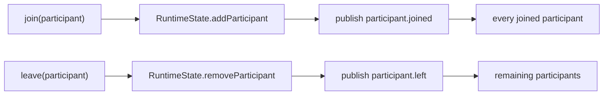
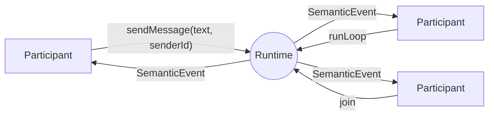
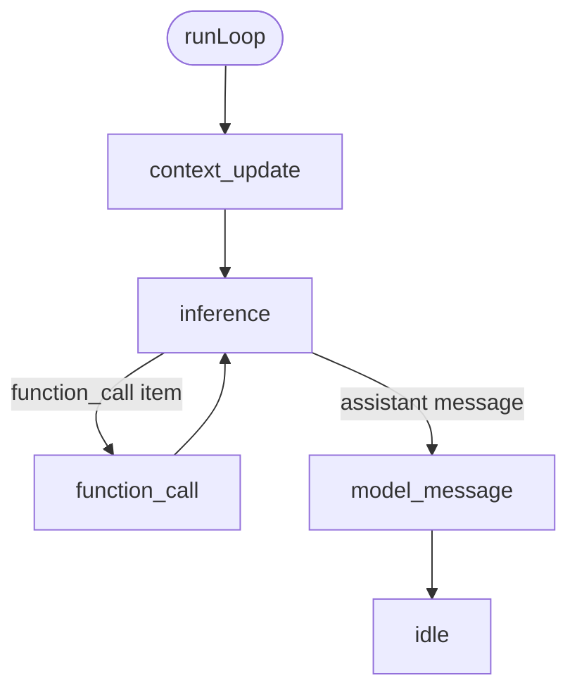
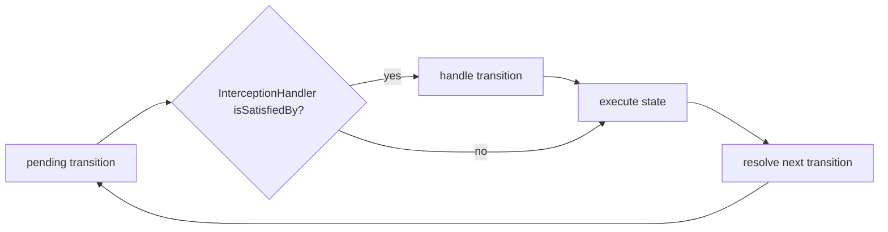
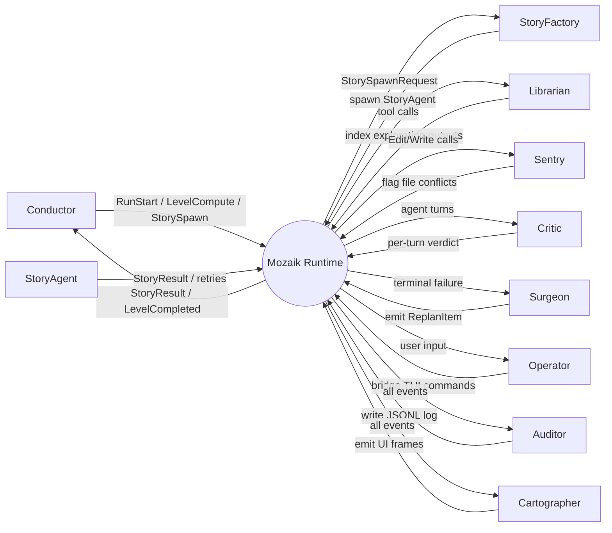

<div align="center">
<h1>Mozaik</h1>
<p>Mozaik is a TypeScript runtime for interoperable AI agents.</p>

  


</div>

## Agent Interoperability

Our main goal is to unlock agent interoperability across projects, so Mozaik is built around three core attributes:

- **Concurrency** - Agents work independently without blocking one another.
- **Awareness** - Agents understand other participants, events, and their shared environment.
- **Adaptivity** - Agents change their behavior based on runtime state and emerging needs.

Together, these capabilities free AI agents from specific harnesses, allowing them to work across projects - so every newly created agent adds value to the entire ecosystem.

---

## Installation

**npm**

```bash
npm install @mozaik-ai/core
```

**yarn**

```bash
yarn add @mozaik-ai/core
```

**pnpm**

```bash
pnpm add @mozaik-ai/core
```

## API Key Configuration

Mozaik picks a provider from the model name you pass to `runInference`, and each provider's SDK reads its credential from the environment. Set the keys for the providers you use:

```env
# .env
OPENAI_API_KEY=your-openai-key-here
ANTHROPIC_API_KEY=your-anthropic-key-here
GEMINI_API_KEY=your-gemini-key-here
```

DeepSeek models run through the OpenAI-compatible chat-completions endpoint, so they use an OpenAI-style credential and base URL (`OPENAI_API_KEY` / `OPENAI_BASE_URL`) pointed at DeepSeek.

---

## Table of contents

- [Runtime](#runtime)
- [Runtime state](#runtime-state)
- [Participants](#participants)
- [Concurrent agents](#concurrent-agents)
- [Semantic events](#semantic-events)
- [Situation handlers](#situation-handlers)
- [The agent loop](#the-agent-loop)
- [Interception](#interception)
- [Examples](#examples)
- [Made with Mozaik](#made-with-mozaik)
- [Contributing](#contributing)

---

## Runtime

The **runtime** is the shared space where participants meet, events are published, and agent loops run. Create one with `defineRuntime`, then call `initializeRuntime` once with a `RuntimeState`:

```ts
import { defineRuntime, RuntimeState } from "@mozaik-ai/core"

class AppState extends RuntimeState {}

const { initializeRuntime, resolveRuntime, resolveParticipant, join, leave, sendMessage, sendEvent, runLoop } =
	defineRuntime<AppState>()

initializeRuntime({ state: new AppState() })
```

`defineRuntime` returns the functions you use for the rest of the session. They are **not** top-level package exports — keep them in module scope (or re-export them yourself):

| Function                                                          | Role                                          |
| ----------------------------------------------------------------- | --------------------------------------------- |
| `initializeRuntime({ state, inferenceRunnerConfig? })`            | Create the runtime. Throws if called twice.   |
| `resolveRuntime()`                                                | The initialized runtime (including `.state`). |
| `resolveParticipant(id)`                                          | Look up a joined participant by id.           |
| `join(participant)` / `leave(participant)`                        | Membership.                                   |
| `sendMessage(message, senderId)`                                  | Publish a `message.sent` event.               |
| `sendEvent(event, senderId)`                                      | Publish any `SemanticEvent`.                  |
| `runLoop(agentId, message, inferenceInput, interceptionHandler?)` | Start an agent loop.                          |

Calling `initializeRuntime` a second time throws `"Runtime already initialized"`. Calling any of the other functions before `initializeRuntime` throws `"Runtime not initialized"`.

---

## Runtime state

**Runtime state** is the typed store every participant shares. `RuntimeState` already holds the participant registry (`participants: Map<string, Participant>`). Subclass it for anything the team needs to share — an active goal, a work queue, a transcript buffer:

```ts
import { defineRuntime, RuntimeState } from "@mozaik-ai/core"

class AppState extends RuntimeState {
	activeGoal?: string
}

const { initializeRuntime, resolveRuntime } = defineRuntime<AppState>()

initializeRuntime({ state: new AppState() })

resolveRuntime().state.activeGoal = "ship the runtime docs"
```

Participants read and write this object from situation processors (and from an `InterceptionHandler`). There is no second hidden store.

---

## Participants

A **participant** is anyone who can join the runtime. Mozaik ships two factories:

| Role         | Factory                                                             | What it carries                                                                                                                     |
| ------------ | ------------------------------------------------------------------- | ----------------------------------------------------------------------------------------------------------------------------------- |
| **Human**    | `createHuman({ name, capabilities, handlers })`                     | A manifest and situation handlers. Typically calls `sendMessage`.                                                                   |
| **Agent**    | `createAgent({ name, capabilities, instruction, tools, handlers })` | Manifest, handlers, an instruction, tools, and memory (`agent.getMemory().getContext()`). Typically starts thinking with `runLoop`. |
| **Observer** | Either factory, handlers only                                       | Never calls `sendMessage` or `runLoop` — only reacts.                                                                               |

Every participant has a **manifest** (`id`, `name`, `role`, `capabilities`) and a list of **situation handlers**. Identity is the manifest; behavior is the handlers you register — not method overrides on a base class.

```ts
import { createAgent, createHuman } from "@mozaik-ai/core"

const human = createHuman({ name: "User", capabilities: [], handlers: [] })

const agent = createAgent({
	name: "Assistant",
	capabilities: ["inference"],
	instruction: "You are a helpful teammate.",
	tools: [],
	handlers: [],
})
```

The role is which functions a participant calls and which specifications it registers. A critic that only watches `model.answer` from others is still just a participant.

---

## Concurrent agents

Several participants can be joined at the same time. Membership is runtime state, and every membership change is an event:



- `join(participant)` adds the participant to `RuntimeState` and publishes `participant.joined`. Joining an id that is already present is a no-op.
- `leave(participant)` removes them and publishes `participant.left` to whoever is still joined.
- Each `runLoop(agentId, ...)` creates a new loop with its own `loopId` and does **not** await it. Two agents can think, call tools, and answer at the same time.
- Events from any loop fan out to **every** joined participant. A slow processor is not a barrier: the runtime does not await `processor.apply`.
- Shared mutable data lives on your `RuntimeState` subclass. Situation processors (and interception) are how participants adapt to it.

```ts
const observer = createHuman({ name: "Observer", capabilities: [], handlers: [] })

join(human)
join(agent)
join(observer)

sendMessage("Hello", human.getId())

leave(observer)
```

An agent can wait until a collaborator has joined (`participant.joined`) before calling `runLoop`, or clean up shared state when someone leaves (`participant.left`).

---

## Semantic events

The runtime is an event bus. Everything interesting is a **`SemanticEvent`**:

| Field        | Meaning                                                                  |
| ------------ | ------------------------------------------------------------------------ |
| `type`       | String name of the event (`"message.sent"`, `"inference.completed"`, …). |
| `producerId` | Id of the participant that caused it.                                    |
| `occurredAt` | When it was created.                                                     |
| `payload`    | Typed data for that event.                                               |

`publish` delivers every event to every joined participant. There is no built-in “internal vs external” split — a situation specification filters on `event.type` and on `event.producerId` versus `participant.getId()`.

Participants never poll. Custom events go through `sendEvent(event, senderId)` with any `type` string.

### Lifecycle and messaging

| Event                | Published when                   | Payload                                                     |
| -------------------- | -------------------------------- | ----------------------------------------------------------- |
| `participant.joined` | `join(participant)`              | Participant manifest (`id`, `name`, `role`, `capabilities`) |
| `participant.left`   | `leave(participant)`             | Participant manifest                                        |
| `message.sent`       | `sendMessage(message, senderId)` | `{ message: string }`                                       |
| _custom_             | `sendEvent(event, senderId)`     | Whatever you put on the event                               |

### Agent loop

Producer is the agent whose loop is running:

| Event                      | Published when                                     | Payload                                                  |
| -------------------------- | -------------------------------------------------- | -------------------------------------------------------- |
| `context_update.started`   | The loop begins appending the user message         | Received message plus `loopId`                           |
| `context_update.completed` | Context is ready for inference                     | `InferenceInput` plus `loopId`                           |
| `inference.started`        | The model call begins                              | `InferenceInput`                                         |
| `inference.stream`         | Each streaming chunk (only when `streaming: true`) | The inner provider event                                 |
| `inference.completed`      | The model call finished                            | `InferenceOutput` (`items`, `tokenUsage`, `rowResponse`) |
| `function_call.started`    | A tool is about to run                             | `{ call, inferenceInput }`                               |
| `function_call.completed`  | The tool returned                                  | `FunctionCallOutputItem`                                 |
| `model.answer`             | The assistant message is committed                 | `{ answer: ModelMessageItem }`                           |
| `interception.started`     | An `InterceptionHandler` matched a transition      | The pending `LoopTransition`                             |
| `interception.finished`    | The handler returned (possibly rewritten)          | The transition that will execute                         |

### Streaming

Pass `streaming: true` on the `InferenceInput` you give `runLoop`. The loop takes the `inference_streaming` path and publishes each provider chunk as `inference.stream` (the inner event is the payload). Requesting streaming for a model whose specification has `supportsStreaming: false` fails validation before the API is called.

---

## Situation handlers

Participants **react** by registering situation handlers. The runtime publishes events; a handler is a pair of “when” and “then”:

- **`SituationSpecification`** — `isSatisfiedBy({ event, participant })`. Compose with `.and()`, `.or()`, and `.not()`.
- **`SituationProcessor`** — `apply(context)` is the reaction: `runLoop`, `sendMessage`, mutate runtime state, log, persist, …



Fan-out is synchronous and does not await processors, so a slow listener never blocks producers or other listeners. Participants start receiving events as soon as they `join()`.

There are no built-in specifications — write the ones you need. Self versus others is a filter on `producerId`, not a second handler API.

```ts
import {
	defineRuntime,
	RuntimeState,
	createAgent,
	createHuman,
	SituationSpecification,
	Agent,
	type SituationHandler,
	type SituationContext,
} from "@mozaik-ai/core"

class AppState extends RuntimeState {}

const { initializeRuntime, join, sendMessage, runLoop } = defineRuntime<AppState>()

initializeRuntime({ state: new AppState() })

class WhenOthersSendAMessage extends SituationSpecification {
	isSatisfiedBy({ event, participant }: SituationContext): boolean {
		return event.type === "message.sent" && event.producerId !== participant.getId()
	}
}

const thinkOnMessage: SituationHandler = {
	specification: new WhenOthersSendAMessage(),
	processor: {
		apply({ event, participant }) {
			if (!(participant instanceof Agent)) return
			const { message } = event.payload as { message: string }
			runLoop(participant.getId(), message, {
				model: "gpt-5.5",
				context: participant.getMemory().getContext(),
				tools: participant.getTools(),
			})
		},
	},
}

const agent = createAgent({
	name: "Assistant",
	capabilities: ["inference"],
	instruction: "You are a helpful teammate.",
	tools: [],
	handlers: [thinkOnMessage],
})

const human = createHuman({ name: "User", capabilities: [], handlers: [] })

join(human)
join(agent)

sendMessage("Hello", human.getId())
```

An observer is the same pattern with processors that only take side actions:

```ts
class WhenModelAnswers extends SituationSpecification {
	isSatisfiedBy({ event }: SituationContext): boolean {
		return event.type === "model.answer"
	}
}

const transcript: SituationHandler = {
	specification: new WhenModelAnswers(),
	processor: {
		apply({ event }) {
			console.log("[model.answer]", event.producerId, event.payload)
		},
	},
}

const observer = createHuman({ name: "Transcript", capabilities: [], handlers: [transcript] })
join(observer)
```

Three things to note:

1. “Act on my own outputs” versus “observe others” is a specification filter on `event.producerId` versus `participant.getId()` — not a separate `onExternal*` API.
2. Do not `await` `runLoop` or `sendMessage` inside a processor. They return `void` and keep running in the background while the runtime keeps delivering events.
3. Behaviors compose by **reaction**, not orchestration. Add a second agent whose spec matches `model.answer` and you get a critique loop. Add a transcript observer and you get a UI stream. Neither change touches the existing participants.

---

## The agent loop

`runLoop(agentId, message, inferenceInput, interceptionHandler?)` drives one agent turn as a state machine. It starts at `context_update` and runs until `idle`. Tool execution and the follow-up inference live inside the loop — you do not call a separate function-call runner.

Each step: optionally intercept the pending transition, execute the state, then resolve the next transition.



| State                 | What it does                                                                                     |
| --------------------- | ------------------------------------------------------------------------------------------------ |
| `context_update`      | Appends the user message to the agent's context.                                                 |
| `inference`           | Calls the model and waits for the full response.                                                 |
| `inference_streaming` | Same call, streaming; each chunk is published as `inference.stream`.                             |
| `function_call`       | Runs the matching tool, writes the call and output back into context, then returns to inference. |
| `model_message`       | Publishes `model.answer`, then the loop goes `idle`.                                             |

Transitions use the first matching rule. If inference returns both a function call and an assistant message, the function-call rule wins. After a tool finishes, the loop goes back to `inference` (it does not re-run `context_update`).

The cycle around every state:



`runLoop` is fire-and-forget. Each invocation gets a unique `loopId`, so concurrent agents (or two loops on the same agent) do not share a cursor.

---

## Interception

An **`InterceptionHandler`** inspects or rewrites a loop transition **before** that state runs. Pass it as the optional fourth argument to `runLoop`:

```ts
interface InterceptionHandler {
	isSatisfiedBy(transition: ExecutableTransition): boolean
	handle(transition: ExecutableTransition): Promise<ExecutableTransition>
}
```

When `isSatisfiedBy` is true, the loop publishes `interception.started`, awaits `handle` (which may change `nextStateId` and `input`), publishes `interception.finished`, then executes the returned transition.

```ts
import { type InterceptionHandler } from "@mozaik-ai/core"

const inspectFunctionCalls: InterceptionHandler = {
	isSatisfiedBy(transition) {
		return transition.nextStateId === "function_call"
	},
	async handle(transition) {
		if (transition.nextStateId === "function_call") {
			console.log("about to call", transition.input.call.name)
		}
		return transition
	},
}

runLoop(agent.getId(), message, inferenceInput, inspectFunctionCalls)
```

Use this for policy, logging, or rewriting the next state (for example, swapping a tool call’s input) without putting that logic inside the agent’s situation handlers.

---

## Examples

Working examples are available here: [mozaik-examples](https://github.com/jigjoy-ai/mozaik-examples).

---

## Made with Mozaik

- **[baro](https://github.com/Lotus015/baro)** — a Claude agent orchestrator where ten specialized participants (planner, executors, reviewer, fixer, librarian, auditor, and more) work fully concurrently on the same goal, like a team collaborating in real time instead of a single agent doing everything alone.



---

## Contributing

Contributions are welcome. Please read the [Contributing Guidelines](./CONTRIBUTING.md) before opening an issue or pull request.

## Author & License

Created by the [JigJoy](https://jigjoy.io) team.  
Licensed under the MIT License.
