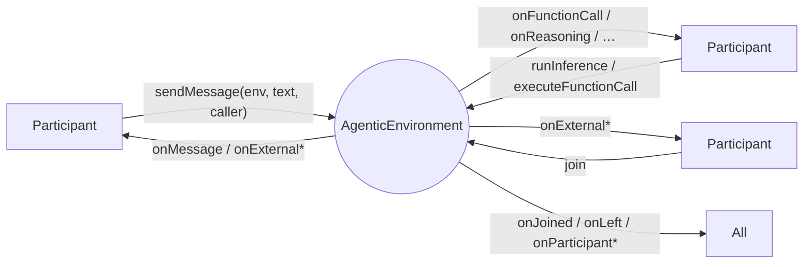
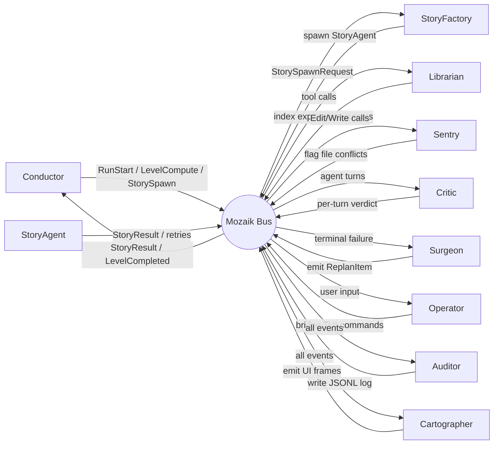

<div align="center">
<h2>Mozaik is a TypeScript runtime for self-organizing AI agents</h2>


  

Mozaik enables agents to communicate, coordinate, and adapt at runtime instead of relying on predefined workflows and fixed handoffs.
</div>

---

## Installation

**npm**

```bash
npm install @mozaik-ai/core
```

**yarn**

```bash
yarn add @mozaik-ai/core
```

**pnpm**

```bash
pnpm add @mozaik-ai/core
```

## API Key Configuration

Mozaik picks a provider from the model name you pass to `runInference`, and each provider's SDK reads its credential from the environment. Set the keys for the providers you use:

```env
# .env
OPENAI_API_KEY=your-openai-key-here
ANTHROPIC_API_KEY=your-anthropic-key-here
GEMINI_API_KEY=your-gemini-key-here
```

DeepSeek models run through the OpenAI-compatible chat-completions endpoint, so they use an OpenAI-style credential and base URL (`OPENAI_API_KEY` / `OPENAI_BASE_URL`) pointed at DeepSeek.

---

## The agentic environment

`AgenticEnvironment` is where everything happens. `Participant`s `join()` it, and from that moment on they can **listen to messages and events** flowing through the environment by overriding any of the handlers below:

| Handler                        | Triggered when…                                        |
| ------------------------------ | ------------------------------------------------------ |
| `onJoined`                     | this participant joins an environment                  |
| `onLeft`                       | this participant leaves an environment                 |
| `onParticipantJoined`          | another participant joins the same environment         |
| `onParticipantLeft`            | another participant leaves the same environment        |
| `onMessage`                    | any participant sends a message                        |
| `onFunctionCall`               | its own inference returns a function call              |
| `onExternalFunctionCall`       | another agent's inference returns a function call      |
| `onFunctionCallOutput`         | its own function call runner returns a result          |
| `onExternalFunctionCallOutput` | another agent's function call runner returns a result  |
| `onReasoning`                  | its own inference returns a reasoning item             |
| `onExternalReasoning`          | another agent's inference returns a reasoning item     |
| `onModelMessage`               | its own inference returns an assistant message         |
| `onExternalModelMessage`       | another agent's inference returns an assistant message |
| `onInternalEvent`              | its own inference emits a semantic stream event        |
| `onExternalEvent`              | another participant emits a semantic stream event      |
| `onError`                      | one of its own handlers throws                         |
| `onParticipantError`           | another participant's handler throws                   |

Every handler defaults to a no-op on `BaseParticipant` — override only the ones you care about.



---

## Non-blocking participants

A participant is any subclass of `Participant`. Use `BaseParticipant` as a base when you only want to override a few handlers — every handler it defines is a no-op. The _role_ (human, agent, observer) is just which capability functions a participant calls and which handlers it overrides:

| Role     | How to build it                                                             |
| -------- | --------------------------------------------------------------------------- |
| Human    | A participant that calls `sendMessage(environment, text, caller)`           |
| Agent    | A participant that calls `runInference(...)` and `executeFunctionCall(...)` |
| Observer | A participant that only overrides handlers and never runs inference         |

```ts
import {
	AgenticEnvironment,
	BaseParticipant,
	ModelContext,
	UserMessageItem,
	runInference,
	sendMessage,
} from "@mozaik-ai/core"

const environment = new AgenticEnvironment()

const human = new BaseParticipant()

class Agent extends BaseParticipant {
	private readonly context = ModelContext.create("demo")

	async onMessage(message: string): Promise<void> {
		this.context.addContextItem(UserMessageItem.create(message))
		runInference({ model: "gpt-5.4", context: this.context, caller: this, environment })
	}
}

const agent = new Agent()
const observer = new BaseParticipant()

human.join(environment)
agent.join(environment)
observer.join(environment)

sendMessage(environment, "Hello", human)
```

Participants react as soon as they `join()` agentic environment. The environment fans every item out to every subscriber synchronously and without awaiting them, so a slow listener never blocks producers or other listeners.

---

## Reactive agent

A reactive agent extends `BaseParticipant` and overrides the handlers it wants to react on. Each handler is already a no-op in the base class, so only the relevant ones need bodies. Capabilities are the free functions `runInference` and `executeFunctionCall` — the participant passes itself as `caller`:

```ts
import {
	BaseParticipant,
	UserMessageItem,
	FunctionCallItem,
	FunctionCallOutputItem,
	ReasoningItem,
	ModelMessageItem,
	AgenticEnvironment,
	ModelContext,
	ModelName,
	Tool,
	runInference,
	executeFunctionCall,
} from "@mozaik-ai/core"

export class ReactiveAgent extends BaseParticipant {
	constructor(
		private readonly environment: AgenticEnvironment,
		private readonly context: ModelContext,
		private readonly tools: Tool[] = [],
	) {
		super()
	}

	// A message from a human (or any other participant) → record it and think.
	async onMessage(message: string): Promise<void> {
		this.context.addContextItem(UserMessageItem.create(message))
		runInference({
			model: 'gpt-5.5',
			context: this.context,
			tools: this.tools,
			caller: this,
			environment: this.environment,
		})
	}

	// The agent just produced a function call → execute it.
	async onFunctionCall(item: FunctionCallItem): Promise<void> {
		this.context.addContextItem(item)
		const tool = this.tools.find((t) => t.name === item.name)
		if (tool) executeFunctionCall(this.environment, item, tool, this)
	}

	// The tool just produced an output → feed it back and run inference again.
	async onFunctionCallOutput(item: FunctionCallOutputItem): Promise<void> {
		this.context.addContextItem(item)
		runInference({
			model: 'gpt-5.5',
			context: this.context,
			tools: this.tools,
			caller: this,
			environment: this.environment,
		})
	}

	// Keep the local context in sync with model-emitted reasoning and replies.
	async onReasoning(item: ReasoningItem): Promise<void> {
		this.context.addContextItem(item)
	}

	async onModelMessage(item: ModelMessageItem): Promise<void> {
		this.context.addContextItem(item)
	}
}
```

Three things to note:

1. The split between self handlers and `onExternal*` handlers means a participant can encode "act on my own outputs" separately from "observe others", without inspecting `source` by hand.
2. The agent never `await`s its capability calls inside the handlers — `runInference` and `executeFunctionCall` are fire-and-forget (they return `void`), so the environment keeps delivering events while inference and tool execution run in the background.
3. Behaviors compose by **reaction**, not orchestration. Add a second agent that overrides `onExternalModelMessage` and you get a critique loop. Add a `TranscriptLogger` and you get a UI stream. Neither change touches the existing participants.

---

## Streaming and semantic events

When inference runs with streaming enabled (`streaming: true` on the `runInference` params, for a model that supports it), the runner does not wait for the full response. As the provider emits chunks, the endpoint yields **`SemanticEvent`** items (`type` + `data`) and the environment delivers each one to **every** joined participant immediately — the same fan-out as messages and context items. Participants react in real time by overriding the stream handlers; no participant needs to poll or share a callback.

The producing participant receives `onInternalEvent`; everyone else receives `onExternalEvent(source, event)`:

```ts
import { BaseParticipant, Participant, SemanticEvent } from "@mozaik-ai/core"

// Agent that runs streaming inference — can observe its own stream chunks.
export class StreamingAgent extends BaseParticipant {
	async onInternalEvent(event: SemanticEvent<unknown>): Promise<void> {
		if (event.type === "response.output_text.delta") {
			// e.g. keep a local buffer of partial output
		}
	}
}

// Any other participant — UI, logger, second agent — reacts to another's stream.
export class LiveTranscript extends BaseParticipant {
	async onExternalEvent(source: Participant, event: SemanticEvent<unknown>): Promise<void> {
		if (event.type === "response.output_text.delta") {
			const { delta } = event.data as { delta: string }
			process.stdout.write(delta)
		}
	}
}
```

Enable streaming by passing `streaming: true` to `runInference`:

```ts
runInference({ model: "gpt-5.4", context, caller: this, environment, streaming: true })
```

Requesting streaming for a model whose specification has `supportsStreaming: false` fails request validation before the API is called.

---

## Lifecycle hooks

Every participant receives lifecycle notifications when it or others join/leave an environment:

```ts
export class TeamAgent extends BaseParticipant {
	// Called when this participant joins an environment.
	onJoined(): void {
		console.log("I joined the environment")
	}

	// Called when this participant leaves an environment.
	onLeft(): void {
		console.log("I left the environment")
	}

	// Called when another participant joins the same environment.
	onParticipantJoined(participant: Participant): void {
		console.log(`${participant.constructor.name} joined`)
	}

	// Called when another participant leaves the same environment.
	onParticipantLeft(participant: Participant): void {
		console.log(`${participant.constructor.name} left`)
	}
}
```

This lets participants react to membership changes — for example, an agent could start inference only after a required collaborator has joined, or clean up shared state when someone leaves.

---

## Reacting to external events

Participants can listen to external events and react by overriding methods like `onMessage`, `onExternalFunctionCall`, `onExternalFunctionCallOutput`, `onExternalReasoning`, and `onExternalModelMessage`.

### Selective listening

By default a participant reacts to events from every other participant. To scope a participant so it only reacts to specific participant _types_, populate its `listens` list with those classes. When `listens` is non-empty, the environment only delivers external events whose source is an instance of one of the listed classes:

```ts
import { BaseParticipant } from "@mozaik-ai/core"

export class Critic extends BaseParticipant {
	// Only react to events produced by Writer participants.
	protected listens = [Writer]
}
```

---

## Error handling

When any handler throws, the environment catches it and routes it as an `AgenticError` instead of crashing the run. The participant whose handler threw receives `onError(error)`; every other participant receives `onParticipantError(source, error)`. After its own `onError`, the failing participant is marked inactive in that environment so it stops receiving further events.

```ts
import { BaseParticipant, Participant, AgenticError } from "@mozaik-ai/core"

export class ResilientAgent extends BaseParticipant {
	onError(error: AgenticError): void {
		console.error("my handler threw:", error.message)
	}

	onParticipantError(source: Participant, error: AgenticError): void {
		console.warn(`${source.constructor.name} failed:`, error.message)
	}
}
```

`AgenticError` carries the originating participant (`getSource()`) and environment (`getEnvironment()`).

---

## Passive observer

You can create observers that don't run inference themselves but watch what's happening in the conversation and take side actions (logging, metrics, persistence, etc.). Subclass `BaseParticipant` and override only the handlers you care about — everything else stays a no-op:

```ts
import {
	BaseParticipant,
	Participant,
	FunctionCallItem,
	FunctionCallOutputItem,
	ReasoningItem,
	ModelMessageItem,
} from "@mozaik-ai/core"

export class TranscriptLogger extends BaseParticipant {
	async onMessage(message: string): Promise<void> {
		console.log("[message]", message)
	}

	async onExternalFunctionCall(source: Participant, item: FunctionCallItem): Promise<void> {
		console.log(`[${source.constructor.name}] function_call`, item)
	}

	async onExternalFunctionCallOutput(source: Participant, item: FunctionCallOutputItem): Promise<void> {
		console.log(`[${source.constructor.name}] function_call_output`, item)
	}

	async onExternalReasoning(source: Participant, item: ReasoningItem): Promise<void> {
		console.log(`[${source.constructor.name}] reasoning`, item)
	}

	async onExternalModelMessage(source: Participant, item: ModelMessageItem): Promise<void> {
		console.log(`[${source.constructor.name}] model_message`, item)
	}
}
```

---

## Examples

Working examples are available here: [mozaik-examples](https://github.com/jigjoy-ai/mozaik-examples).

---

## Made with Mozaik

- **[baro](https://github.com/Lotus015/baro)** — a Claude agent orchestrator where ten specialized participants (planner, executors, reviewer, fixer, librarian, auditor, and more) work fully concurrently on the same goal, like a team collaborating in real time instead of a single agent doing everything alone.



---

## Contributing

Contributions are welcome. Please read the [Contributing Guidelines](./CONTRIBUTING.md) before opening an issue or pull request.

## Author & License

Created by the [JigJoy](https://jigjoy.io) team.  
Licensed under the MIT License.
